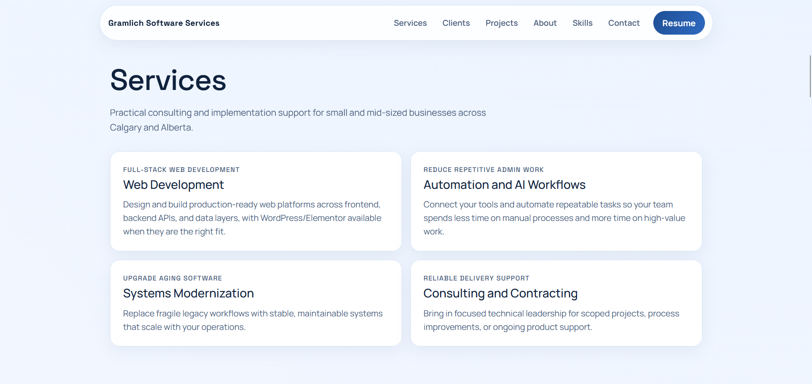
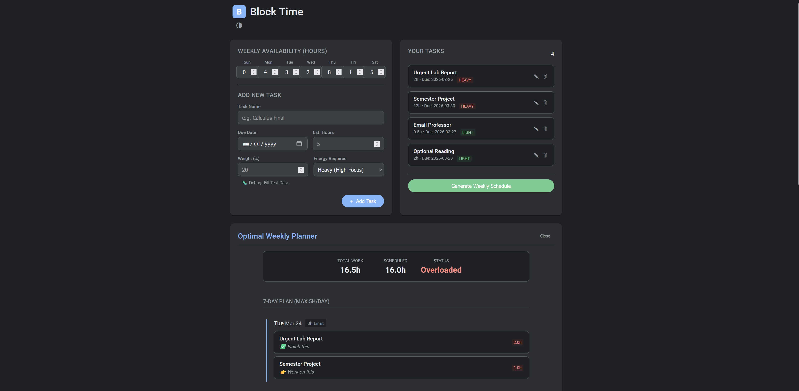

# Riley Gramlich Portfolio

Modern software portfolio site for Gramlich Software Services, focused on practical delivery for Calgary and Alberta organizations.

## Live Site

- [rileygramlich.dev](https://rileygramlich.dev/)

## Home

Serving Calgary and Alberta businesses with modern software systems that save teams hours each week.

Gramlich Software Services helps local organizations streamline operations, modernize outdated tools, and launch websites that convert.

From WordPress and Elementor websites to automation workflows and legacy system modernization, every project is built for measurable business outcomes.

### Core Value Points

- Faster admin workflows
- Lower ongoing maintenance cost
- Clear communication for non-technical teams

### Portfolio Photos

## Services

Practical consulting and implementation support for small and mid-sized businesses across Calgary and Alberta.

- **Web Development**: Full-stack web development for frontend, backend APIs, and data layers, with WordPress/Elementor available when the fit is right.
- **Automation and AI Workflows**: Connect business tools and automate repeatable tasks to reduce manual admin work.
- **Systems Modernization**: Replace fragile legacy workflows with stable, maintainable systems that scale.
- **Consulting and Contracting**: Focused technical leadership for scoped projects and ongoing product support.

## Contracting and Client Work

Trusted by local organizations that value practical execution and measurable operational improvements.

### UrbanTec Condominium Management Inc

- **Website**: [urbantec.ca](https://urbantec.ca)
- **Challenge**: The marketing team needed a modern website experience with a clearer conversion flow and faster page delivery.
- **Solution**: Partnered with marketing stakeholders to redesign content structure, simplify user journeys, and implement a performance-first front end.
- **Impact**: Launched a cleaner, marketing-aligned website flow with high-speed page loads that improved usability and campaign readiness.

### Prairie.edu

- **Website**: [prairie.edu](https://prairie.edu)
- **Challenge**: Marketing and communications teams needed a refreshed website flow that felt modern and performed quickly across devices.
- **Solution**: Delivered contracting support to align design and page architecture with marketing goals, while optimizing assets and templates for speed.
- **Impact**: Produced a modernized web experience with stronger flow, faster load times, and easier campaign execution for internal teams.

## Projects

Selected work focused on operational efficiency, clearer workflows, and practical business impact.

### BlockTime

- **Live**: [BlockTime App](https://rileygramlich.github.io/BlockTime/)
- **GitHub**: [BlockTime Repository](https://github.com/rileygramlich/BlockTime)
- **Problem**: Students were struggling to balance assignments, deadlines, and study sessions across multiple classes.
- **Solution**: Built as a group project, BlockTime helps students organize tasks, prioritize coursework, and plan their week clearly.
- **Impact**: Improved day-to-day time management by turning scattered school tasks into one clear planning flow.

### Scribist

- **Project Link**: [Scribist](https://github.com/rileygramlich/scribist)
- **GitHub**: [Scribist Repository](https://github.com/rileygramlich/scribist)
- **Problem**: Writers needed a distraction-free environment with real-time collaboration options.
- **Solution**: Delivered a MERN-based writing platform with editing tools and performance-focused UX.
- **Impact**: Improved writing focus while supporting collaborative content workflows.

### Glossa Galore

- **Project Link**: [Glossa Galore](https://github.com/rileygramlich/glossa-galore)
- **GitHub**: [Glossa Galore Repository](https://github.com/rileygramlich/glossa-galore)
- **Problem**: Language learners needed a stronger community layer for consistent engagement.
- **Solution**: Created a social language-learning platform with account management and structured interactions.
- **Impact**: Helped users stay engaged and practice more consistently.

## About

I am Riley Gramlich, a Calgary-based software developer focused on practical solutions for small and mid-sized teams. My work blends product thinking with hands-on engineering so projects ship quickly and stay maintainable.

Whether the engagement is a new website, internal tool, or process automation initiative, the goal is the same: reduce friction, improve reliability, and give teams systems they can confidently operate.

### What Clients Value Most

- Clear timelines and straightforward communication
- Solutions that fit real team workflows
- Full-stack delivery from UI through backend
- Modern tools without unnecessary complexity
- Calgary and Alberta business context

### Full-Stack Skills

#### Frontend

- React and JavaScript
- TypeScript
- Responsive UI architecture
- Component libraries and design systems

#### Backend

- Node.js and Express APIs
- Python automation services
- Authentication and role-based access
- Third-party integrations

#### Data and Cloud

- SQL and PostgreSQL
- REST data modeling
- Deployment and environment configuration
- Monitoring and operational support

#### Delivery

- Discovery and technical scoping
- Workflow automation with AI tooling
- Legacy system modernization
- Ongoing consulting and iteration

## Contact

Start a project conversation: tell me what your team is trying to improve and I will follow up with a practical next step.

## Resume and Socials

- **Resume**: [Riley Gramlich Resume PDF](https://rileygramlich.dev/pdfs/riley-gramlich-resume.pdf)
- **GitHub**: [rileygramlich](https://github.com/rileygramlich)
- **LinkedIn**: [Riley Gramlich](https://www.linkedin.com/in/rileygramlich/)
- **X (Twitter)**: [@rileygramlich](https://x.com/rileygramlich)

## Technologies Used

- React
- JavaScript
- CSS
